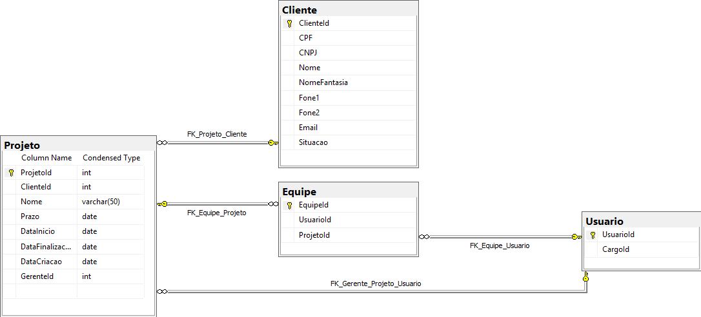
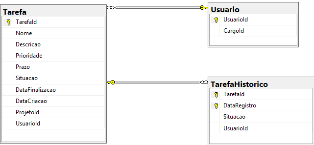
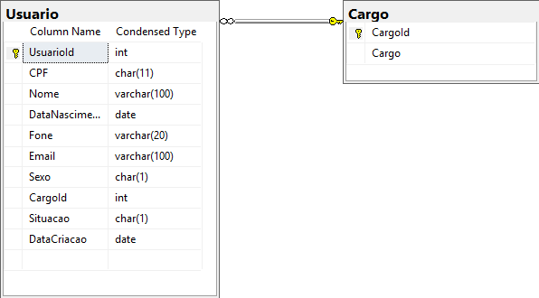

# BlueMine DataBase
Banco para estudos de banco de dados SQL Server

**Importante**
O banco de dados está em desenvolvimento.

## Scripts
utilize o arquivo `scripts.sql` para gerar a estrutura apresentada nos diagramas abaixo

## Diagramas
#### Diagrama de Projeto

#### Diagrama de Tarefa

#### Diagrama de Usuario

## Detalhes

#### Campos
- DataCriacao: Adiciona a data de inclusão d registro
- DataAlteracao: Adiciona a data da última alteração por uptade. Utiliza trigger para registrar essa informação

#### Tabela Tarefa

- Possui uma trigger para Registrar o histórico das informações na tabela TarefaHistorico. *Na Próxima Versão* utilizaremos Temporal Tables do SQL Server.

#### JOBS
- JOB tarefas: fecha/encerra uma tarefa após 48 horas como resolvida