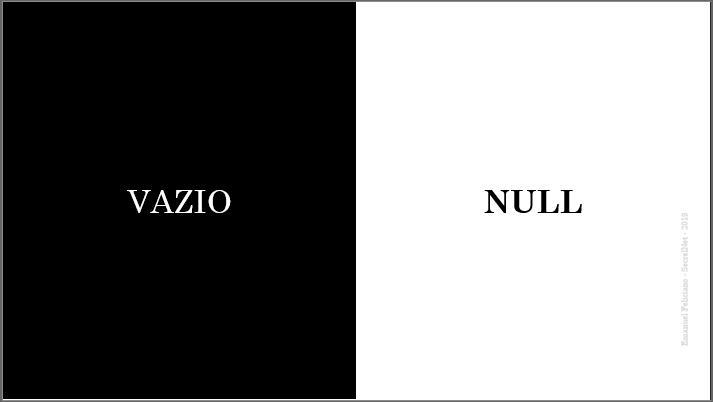
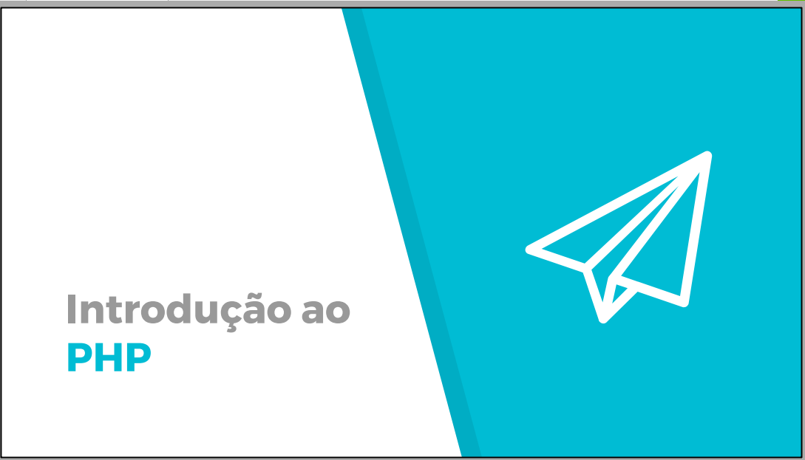
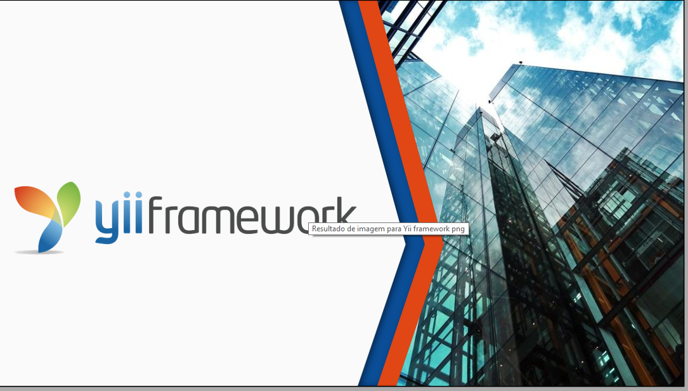

# Treinamentos
Aulas disponibilizadas

## SQL SERVER
>Curso focado nos fundamentos e boas práticas desenvolvedores e analistas de banco de dados. 
Mais informações: https://secrel.com.br/produto/fundamentos-de-banco-de-dados-sql-server/ 

### Vazio vs NULL
Nesta aula falaremos sobre a importância de se compreender 2 informações similares porém completamente `diferentes`. Disponibilizei um conteúdo exclusivo para este assunto pois muitos profissionais ainda `escorregam` no tratamento correto destes dados.

### Revisão
Segue uma breve revisão sobre os principais comandos SQL visto em sala de aula.

## PHP e MYSQL
>Curso PHP Orientado à Objetos
Mais informações: https://secrel.com.br/produto/php-7-com-mysql/  

### Introdução ao PHP
 Aula rápida e prática sobre PHP. Em poucos minutos você está apto para criar suas páginas em PHP.

### Introdução ao Yii Framework
Yii framework é sem dúvida um dos frameworks mais práticos e rápido para PHP. Inspirado no Ruby, possui arquitetura inteligente, é orientado a objetos e permite o desenvolvimento de sistemas focado nas regras de negócio.

