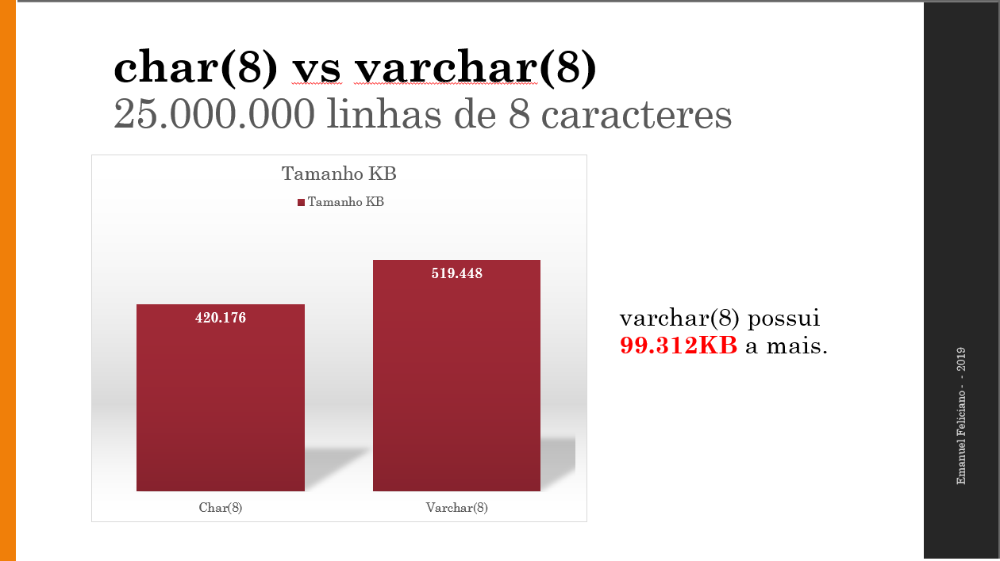
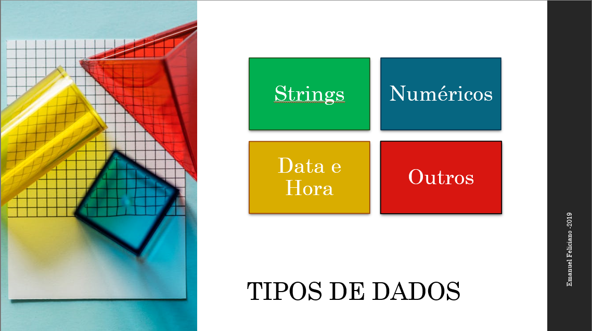
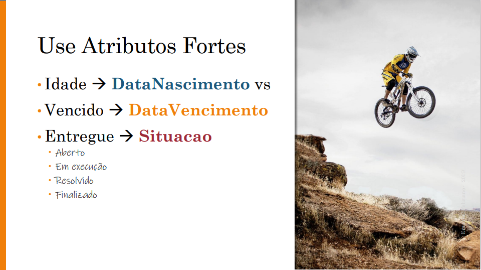

# Treinamentos
Exemplo de aulas disponibilizadas aqui no Github!

## SQL SERVER
>Curso focado nos fundamentos e boas práticas desenvolvedores e analistas de banco de dados. 
Mais informações: https://secrel.com.br/produto/fundamentos-de-banco-de-dados-sql-server/ 

### Aula 01
Uploading...

### Aula 02
Tabela Tarefa

### Aula 03
#### 3.1 Tipos de Dados

#### 3.2 Melhorando Tabela Tarefa

#### 3.3 Tabela Usuário

#### 3.4 Introdução : Chaves Primária

### Vazio vs NULL
Vazios vs Nulos: Cammpos similares porém `diferentes`. Uma aula exclusiva sobre um assunto que ainda gera dúvidas em muitos profissionais.

### Revisão
Segue uma breve revisão sobre os principais comandos SQL visto em sala de aula.

## PHP e MYSQL
>Curso PHP Orientado à Objetos
Mais informações: https://secrel.com.br/produto/php-7-com-mysql/  

### Introdução ao PHP
 Aula rápida e prática sobre PHP. Em poucos minutos você está apto para criar suas páginas em PHP.

### Introdução ao Yii Framework
Yii framework é sem dúvida um dos frameworks mais práticos e rápido para PHP. Inspirado no Ruby, possui arquitetura inteligente, é orientado a objetos e permite o desenvolvimento de sistemas focado nas regras de negócio.

